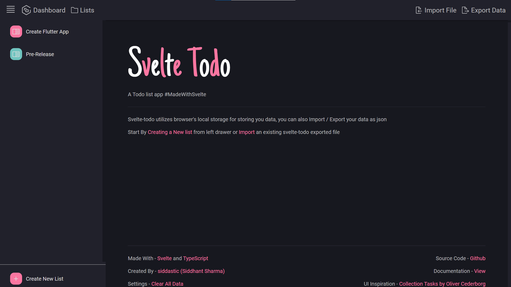

# SvelteTODO

A Todo list app #MadeWithSvelte


Svelte-todo utilizes browser's local storage for storing you data, you can also Import / Export your data as json
<br>

### Running Live At - <a href="https://siddastic.github.io/svelte-todo/" target="_blank">siddastic.github.io/svelte-todo/</a>
<br>

### Technologies Used
[](https://svelte.dev/) &nbsp; [](https://www.typescriptlang.org/) &nbsp; [](https://nodejs.org/en/) &nbsp;
<br>
<br>

### How It Looks ✨🎉🎊
<br>



<br>
<br>

### Running Locally

1. Install dependencies
```bash
npm i
```
2. Run Development Server
```bash
npm run dev
```
3. Build with rollup
```bash
npm run build
```

### Credits
#### UI Inspiration - <a href="https://dribbble.com/shots/15185058-Collection-Tasks" target="_blank">Collection Tasks by Oliver Cederborg</a> <br/>
#### Development - <a href="https://github.com/siddastic" target="_blank">siddastic (me...)</a>
---

## Contributing
Pull requests are welcome. For major changes, please open an issue first to discuss what you would like to change.

Please make sure to update tests as appropriate.

## License
[MIT](https://choosealicense.com/licenses/mit/)